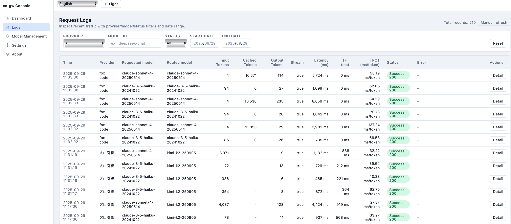

# cc-gw

> **中文** | [English](#english)

cc-gw 是一个面向 Claude Code 与同类客户端的本地多模型网关，负责：

- 归一化 `/v1/messages` 请求并映射到不同 Provider / 模型
- 复刻 Claude API 的流式与工具调用语义
- 记录请求日志、Token（含缓存命中）、TTFT/TPOT 等运行指标
- 提供可视化 Web 管理台与守护进程 CLI

核心组件：

| 模块 | 说明 |
| ---- | ---- |
| `@cc-gw/server` | Fastify 服务，实现协议转换、模型路由、Provider 适配与日志存储（支持 Anthropic 原生 payload/headers 透传与缓存统计） |
| `@cc-gw/web` | React + Vite Web UI，包含仪表盘、日志面板、模型管理、系统设置 |
| `@cc-gw/cli` | CLI 守护工具，封装 start/stop/restart/status 并托管 PID/日志 |

## 快速开始

### 推荐方式：npm 全局安装

```bash
npm install -g @chenpu17/cc-gw
cc-gw start --daemon --port 4100
```

首启会在 `~/.cc-gw/config.json` 生成配置模板，推荐直接通过 Web UI (`http://127.0.0.1:4100/ui`) 完成所有后续配置与调整。`cc-gw status`、`cc-gw stop`、`cc-gw restart` 可用于日常运维。

> ⚠️ **Linux 安装提示**：如果未命中 sqlite3 的预编译二进制，需要系统具备 `build-essential`、`python3`、`python3-gyp` 等编译依赖。可执行 `sudo apt install build-essential python3 python3-gyp` 后，再运行 `npm install -g @chenpu17/cc-gw --unsafe-perm --build-from-source`。

### 从源码构建（开发者）

前置：Node.js 18.18+（推荐 20 LTS）、pnpm 8+

```bash
pnpm install
pnpm --filter @cc-gw/server build
pnpm --filter @cc-gw/web build
pnpm --filter @cc-gw/cli exec tsx index.ts start --daemon --port 4100
```

> ✅ 首次启动后推荐直接使用 Web 管理台完成 Provider、模型、日志等设置；仅在自动化或高级场景下再手动编辑配置文件。

## Web 管理台

强烈建议以 Web 管理台作为主要的配置入口，可视化界面涵盖仪表盘、请求日志、模型管理与系统设置，所见即所得，避免手工改动 JSON 引入错误。

访问 `http://<host>:<port>/ui`，主要页面：

- **Dashboard**：展示请求量、Token 使用、缓存命中、各模型 TTFT（Time To First Token）/TPOT（Total Processing Time）、SQLite 数据库占用。
- **请求日志**：多条件筛选（时间、Provider、模型、状态），查看压缩日志详情，支持分页导出与清理。
- **模型管理**：维护 Provider 列表、预置模型、路由策略；一键测试连通性（发送诊断 PROMPT）。
- **系统设置**：端口、日志保留策略、是否存储请求 payload、日志级别与访问日志开关、日志清理工具。
- **使用指南**：提供图文步骤、常见问题与排查提示，帮助团队成员快速熟悉配置流程。

UI 支持中英文、深色/浅色主题以及移动端响应式布局，提供键盘可达性（Skip Link、焦点管理）。

#### 界面预览




### 连接 Claude Code
1. 启动 cc-gw 并确认配置中 `host` 为 `127.0.0.1`，`port` 与 CLI 启动一致。
2. 在安装了 Claude Code 的终端设置环境变量：
   ```bash
   export ANTHROPIC_BASE_URL=http://127.0.0.1:4100
   claude "help me review this file"
   ```
3. cc-gw 会根据 `modelRoutes`/默认策略将 Claude 请求路由到已配置的目标模型（如 Kimi、火山 DeepSeek、OpenAI 或自建模型）。

### 使用场景 / Usage Scenarios

1. **双端点适配 / Dual Endpoint Support**：通过 `/anthropic` 与 `/openai` 端点，分别兼容 Claude Code 与 Codex 客户端。无需重启 cc-gw，即可在 Web UI 中为两个端点配置独立的默认模型与路由策略。
2. **日志追踪 / Request Auditing**：在“请求日志”页按端点、Provider、API Key 等维度筛选记录，可直接查看和复制完整的请求/响应 payload，辅助排查联调问题。
3. **模型切换 / Cross-Provider Routing**：利用“模型管理”页的路由映射，将 Claude Code 请求透明地转发到 GLM、Kimi K2、DeepSeek 等任意 OpenAI 兼容模型，实现一套 IDE 客户端、多家大模型的快速切换。
4. **操作指引 / Built-in Guidance**：左侧“Help”导航提供分步配置、日常运维建议及 FAQ，可作为新人上手或问题排查的快速参考。

## 配置说明

大多数场景请通过 Web 管理台调整设置，以下仅作为 `~/.cc-gw/config.json` 结构参考，便于脚本化或排查：

```json
{
  "host": "127.0.0.1",
  "port": 4100,
  "providers": [
    {
      "id": "kimi",
      "label": "Moonshot Kimi",
      "type": "kimi",
      "baseUrl": "https://api.moonshot.cn/v1",
      "apiKey": "sk-...",
      "models": [
        { "id": "kimi-k2-0905-preview", "label": "Kimi K2" }
      ]
    },
    {
      "id": "anthropic",
      "label": "Claude",
      "type": "anthropic",
      "baseUrl": "https://api.anthropic.com",
      "apiKey": "sk-ant-...",
      "models": [
        { "id": "claude-3-5-sonnet-latest" }
      ]
    }
  ],
  "defaults": {
    "completion": "kimi:kimi-k2-0905-preview",
    "reasoning": "anthropic:claude-3-5-sonnet-latest",
    "background": "kimi:kimi-k2-0905-preview",
    "longContextThreshold": 60000
  },
  "modelRoutes": {
    "claude-sonnet-4-5-20250929": "kimi:kimi-k2-0905-preview",
    "claude-opus-4-1-20250805": "anthropic:claude-3-5-sonnet-latest"
  },
  "logRetentionDays": 30,
  "storePayloads": true,
  "logLevel": "info",
  "requestLogging": true,
  "responseLogging": true
}
```

字段要点（建议仍以 Web UI “系统设置 / 模型管理” 进行操作，下列仅便于理解结构）：

- `providers`：定义上游服务；`type` 支持 `openai | anthropic | kimi | deepseek | custom`。
- 模型标识使用 `providerId:modelId` 形式供路由引用。
- `modelRoutes`：将 Claude 发起的模型名映射到上游模型；未命中时使用 `defaults`。
- `storePayloads`：是否在 SQLite 中压缩保存原始请求/响应（Brotli），关闭后仅保留元信息。
- `logLevel`：控制 Fastify/Pino 控制台日志级别（`fatal`/`error`/`warn`/`info`/`debug`/`trace`）。
- `requestLogging`：是否输出每个 HTTP 请求的进入日志。
- `responseLogging`：是否输出每个 HTTP 请求完成的日志，可独立于 `requestLogging` 控制。
- 推荐通过 Web UI 的“模型管理 / 系统设置”在线编辑并热加载，无需手工修改文件。

#### Anthropic Provider 额外说明

- 当 Provider `type` 设置为 `anthropic` 时，网关会保留 Claude Code 发来的完整 payload，并将其原样转发到 `<baseUrl>/v1/messages`，无需转换工具调用或 metadata 字段。
- 所有自定义 Header（如 `x-stainless-*`、`anthropic-beta`、`anthropic-dangerous-direct-browser-access`）会自动透传到下游，确保 Claude Code 的诊断与调试能力不受影响。
- usage 统计会解析 `cache_read_input_tokens` / `cache_creation_input_tokens`，从而在日志与 Web UI 的 Token 指标中显示缓存命中或写入量；Moonshot / Anthropic 若未返回上述字段，则 `cached` 会继续显示为空。

### 环境变量

| 变量 | 说明 |
| ---- | ---- |
| `PORT` | CLI 启动时临时覆盖监听端口 |
| `CC_GW_UI_ROOT` | 指定 Web UI 静态目录（默认自动检测 `@cc-gw/web` build 结果） |
| `CC_GW_DEBUG_ENDPOINTS` | 设为 `1` 可在日志中输出下游请求 URL |

## CLI 守护

```bash
pnpm --filter @cc-gw/cli exec tsx index.ts start [--daemon] [--port 4100]
pnpm --filter @cc-gw/cli exec tsx index.ts stop
pnpm --filter @cc-gw/cli exec tsx index.ts restart [--daemon] [--port 4100]
pnpm --filter @cc-gw/cli exec tsx index.ts status
```

- 守护模式下 PID/日志存放于 `~/.cc-gw/cc-gw.pid` 与 `~/.cc-gw/logs/cc-gw.log`。
- `status` 会回显配置与日志路径，便于排查。

## 数据与日志

- 数据库：`~/.cc-gw/data/gateway.db`（`sqlite3`）。
  - `request_logs`：请求摘要、路由结果、耗时、TTFT/TPOT。
  - `request_payloads`：压缩的请求/响应正文（Brotli）。
  - `daily_metrics`：按日聚合的调用次数与 Token 统计。
- 日志：`~/.cc-gw/logs/cc-gw.log`，包含请求生命周期、Provider 调用与 usage 摘要（`event: usage.metrics`）。

## 常见问题

- **Web UI 404**：请确认执行过 `pnpm --filter @cc-gw/web build`，并在 CLI 启动时自动或手动设置 `CC_GW_UI_ROOT`。
- **usage 中无 `cached_tokens`**：部分 Provider（如火山 DeepSeek）需开启 `stream_options.include_usage` 或提供专有缓存参数；cc-gw 已在支持的适配器中自动注入，如仍为 `null` 需确认上游是否支持。
- **日志数据库过大**：可在“系统设置”关闭 payload 保存或缩短保留天数；Web UI 亦提供手动清理工具。

---

## English

cc-gw is a local gateway tailored for Claude Code and similar Anthropic-compatible clients. It normalizes `/v1/messages`, routes traffic across heterogeneous providers, mirrors Claude’s streaming & tool semantics, and records detailed metrics that surface in a bilingual Web console and CLI daemon.

### Highlights

| Feature | Details |
| ------- | ------- |
| Protocol adaptation | Converts Claude-style payloads into OpenAI-, Anthropic-, Kimi-, and DeepSeek-compatible requests while preserving tool calls and reasoning blocks. |
| Model routing | Maps incoming model IDs to configured upstream providers with fallbacks for long-context and background tasks. |
| Observability | Persists request logs, token usage (including cache hits), TTFT, TPOT, and daily aggregates in SQLite with Brotli-compressed payloads. |
| Web console | React + Vite UI with dashboards, filters, provider CRUD, bilingual copy, and responsive layout. |
| CLI daemon | `cc-gw` command wraps start/stop/restart/status, manages PID/log files, and scaffolds a default config on first launch. |

### Quick Start

```bash
npm install -g @chenpu17/cc-gw
cc-gw start --daemon --port 4100
```

The first launch writes `~/.cc-gw/config.json`. Manage everything through the Web UI at `http://127.0.0.1:4100/ui`. Use `cc-gw status`, `cc-gw stop`, and `cc-gw restart` to control the daemon.

> ⚠️ **Linux build note**: `sqlite3` may fall back to building from source. Install toolchain packages such as `build-essential`, `python3`, `python3-gyp`, then rerun `npm install -g @chenpu17/cc-gw --unsafe-perm --build-from-source` if needed.

### From Source (contributors)

```bash
pnpm install
pnpm --filter @cc-gw/server build
pnpm --filter @cc-gw/web build
pnpm --filter @cc-gw/cli exec tsx index.ts start --daemon --port 4100
```

Connect Claude Code by pointing `ANTHROPIC_BASE_URL` to your local gateway:

```bash
export ANTHROPIC_BASE_URL=http://127.0.0.1:4100
claude "help me review this file"
```

### Configuration Snapshot

- Providers include `type`, `baseUrl`, `apiKey`, and `models` descriptions.
- When `type` is `anthropic`, cc-gw forwards the original Claude payload and all headers to `<baseUrl>/v1/messages`, so tool calls/metadata remain intact.
- Model routes use `providerId:modelId` syntax to remap Claude requests.
- `storePayloads` toggles compressed body retention; disable to keep only metadata.
- `logLevel` adjusts Fastify/Pino verbosity (`fatal` → `trace`).
- `requestLogging` controls whether per-request access logs are emitted to the console.
- `responseLogging` toggles completion logs separately so you can keep the console quieter while preserving metrics.
- Web UI allows editing without restarting; CLI restart will pick up bundle changes after rebuilds.

### Observability & Storage

- SQLite file under `~/.cc-gw/data/gateway.db` tracks logs and aggregated metrics.
- Dashboard surfaces per-model TTFT/TPOT, cache hits（including Anthropic `cache_read_input_tokens` / `cache_creation_input_tokens`）, and DB size.
- Logs can be filtered/exported/cleaned directly from the UI.

### CLI Reference

| Command | Description |
| ------- | ----------- |
| `cc-gw start [--daemon] [--port]` | Launch the Fastify server, auto-creating config if missing. |
| `cc-gw stop` | Send SIGTERM and remove stale PID files. |
| `cc-gw restart` | Convenience wrapper for stop + start. |
| `cc-gw status` | Show running status, PID, log directory, config path. |

### Environment

| Variable | Purpose |
| -------- | ------- |
| `PORT` | Override listening port at launch. |
| `CC_GW_UI_ROOT` | Manually point to the built web assets. |
| `CC_GW_DEBUG_ENDPOINTS=1` | Log upstream provider endpoints for debugging. |

### Tips

- Always rebuild `@cc-gw/server` and `@cc-gw/web` before restarts to ensure the daemon picks up new code.
- If cache statistics remain zero, verify whether the upstream provider exposes `cached_tokens` or equivalent details.
- Back up `~/.cc-gw/` (config, logs, SQLite DB) for migrations or disaster recovery.
- Use the **Help** page in the Web UI to review setup steps, troubleshooting tips, and FAQs whenever a teammate needs a refresher.

---

欢迎通过 Issue / PR 反馈改进意见，也可以在 Web UI 的“关于”页查看贡献者信息与致谢。
